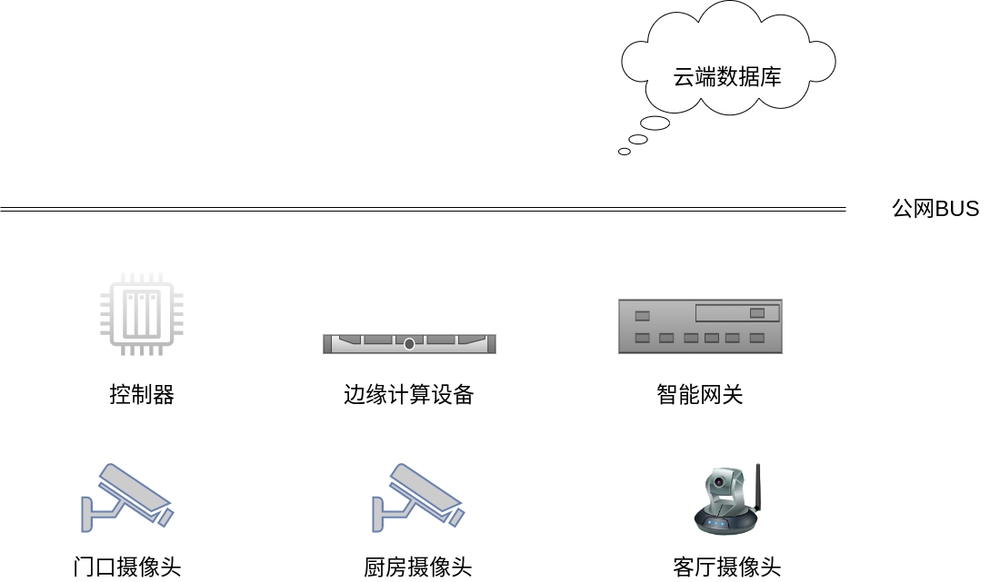

# 智慧家居安防系统


## 代码开发环境搭建

```bash
conda create -n nuomi python=3.7
conda activate nuomi

git clone https://github.com/kelamini/NuoMi.git
cd NuoMi
pip install -r requirements.txt
```


## 运行该项目

1. 启动 rtsp 服务
```bash
cd mediamtx
./mediamtx
```
2. 运行端侧设备
```bash

```

3. 启动 Qt 管理界面
```bash
cd nuomi/interface
python main.py
```


## 场景和功能
 - 外门门口处
    - 人脸识别
    - 杂物堆放告警 && 快递堆放上告
    - 行为检测上告
 - 厨房安全
    - 明厨亮灶检测
 - 客厅（待确定）
    - 手势识别
        - 灯光调节
        - 空调开关


## 方案设计

### 设备拓扑图



 ## 系统界面开发

 1. 服务端
    - 后台任务管理
    - 后台设备管理
    - 后台人员数据库管理
 2. 客户端
    - 浏览器
    - 微信小程序
